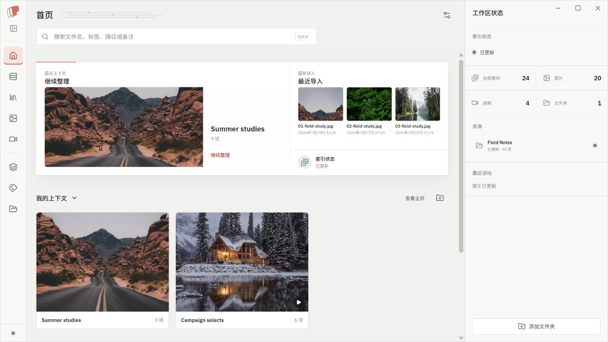
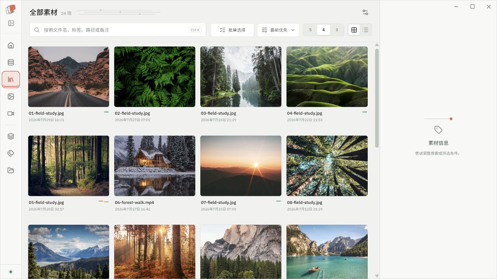
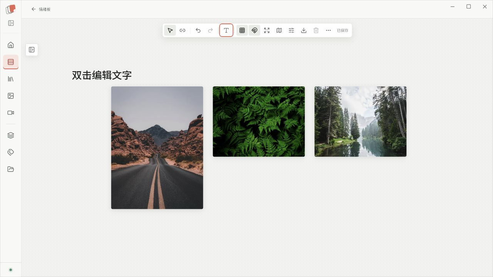

# Tagloom

Tagloom 是一款本地优先的图片与视频素材管理桌面应用。它把素材库、上下文、标签与情绪板放在一个工作台中，帮助你从整理参考到搭建视觉方向，全程保持原始文件留在本机。

> 当前版本：`0.1.0-alpha.4`。这是早期公开预览版本，适合体验和反馈；请勿将其作为唯一的素材数据备份方案。

## 界面预览

| 首页 | 素材库 |
| --- | --- |
|  |  |

### 情绪板



情绪板是独立的工作台入口，可关联多个上下文，但不会复制、移动或修改原始素材。画布支持：

- 从关联上下文或全库搜索中选择素材并放入画布
- 文字节点编辑、素材缩放、8px 吸附与点阵网格
- 四方向端口连线、框选、多选、对齐、层级调整与删除
- 空格或中键平移、Shift 框选、撤销/重做与自动保存
- 完整情绪板导出 PNG，不包含编辑控件

## 主要功能

- 扫描本地图片和视频目录，不上传素材内容
- 网格与列表浏览，批量选择与 Shift 连续范围选择
- 文件夹、上下文和标签管理
- 图片预览、视频封面与兼容代理播放
- 本地 SQLite 索引、缩略图缓存与数据库备份
- 中文和英文界面

## 下载与安装

Windows x64 安装包与便携版在 [GitHub Releases](https://github.com/Chrp-L/tagloom/releases) 提供。

- `tagloom-<version>-windows-x64-setup.exe`：NSIS 安装包
- `tagloom-<version>-windows-x64-portable.zip`：便携版，解压后运行 `Tagloom.exe`
- 每个包均附带 `.sha256` 文件，可用于校验下载完整性

当前版本为预发布版本，首次运行前请确认系统已安装 Microsoft Edge WebView2 Runtime。

## 环境要求

- Windows 10/11 x64
- Node.js 20 或更高版本
- Rust stable 工具链
- Visual Studio C++ Build Tools
- Microsoft Edge WebView2 Runtime
- PowerShell 5.1 或更高版本

## 开发环境

```powershell
git clone https://github.com/Chrp-L/tagloom.git
cd tagloom
npm ci
powershell -ExecutionPolicy Bypass -File .\scripts\setup-media-tools.ps1
npm run tauri:dev
```

`npm run tauri:dev` 使用 `Tagloom Dev` 身份和独立数据目录，不会读取或修改安装版的数据库、缩略图、视频代理、日志与备份。日常开发请使用该命令；普通 debug 构建在后端也会自动使用开发数据目录。

媒体工具不会提交到 Git。安装脚本会把以下依赖放入 `src-tauri/binaries`：

- FFmpeg 与 FFprobe：BtbN Windows LGPL 构建
- ExifTool 13.59：ExifTool 官方 SourceForge 发布包

重新下载依赖：

```powershell
powershell -ExecutionPolicy Bypass -File .\scripts\setup-media-tools.ps1 -Force
```

## 测试与构建

```powershell
npm test -- --run
npm run build
npm run tauri:build
```

`npm run build` 只构建前端资源。`npm run tauri:build` 使用正式应用身份生成 Windows NSIS 安装包，并要求媒体工具已安装。

## 数据与隐私

Tagloom 在本机应用数据目录保存 SQLite 索引、缩略图、视频代理、日志和备份。原始图片与视频不会被移动或上传；删除操作使用系统回收站。

在升级 alpha 版本前，建议先使用应用内数据库备份功能。`1.0.0` 之前的数据结构和行为仍可能调整。

## Alpha 限制

- 当前只提供 Windows x64 构建
- 第一次播放部分视频时需要等待兼容代理生成
- 大型素材库和异常格式仍需要更多真实数据验证
- 自动更新、签名安装包和稳定迁移策略尚未完成

## 第三方工具

FFmpeg、FFprobe 和 ExifTool 保持各自许可证。相关许可证文本位于 `src-tauri/binaries`。本仓库目前尚未声明项目级开源许可证。

## 反馈

请通过 GitHub Issues 提交可复现的问题，并附上系统版本、操作步骤和相关日志。提交前请移除日志中的私人文件路径。
